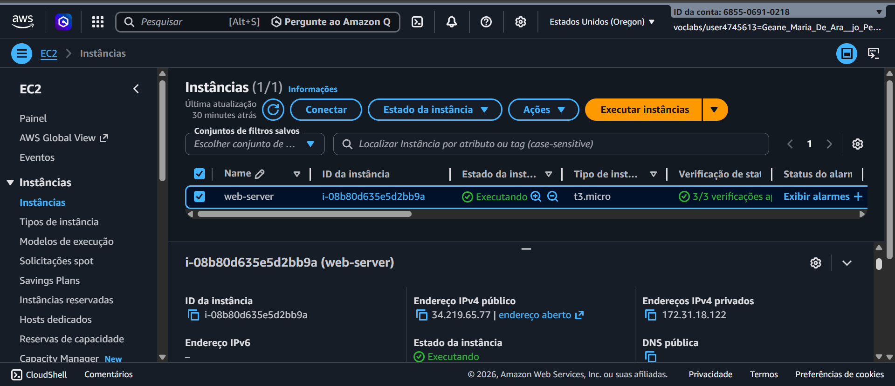
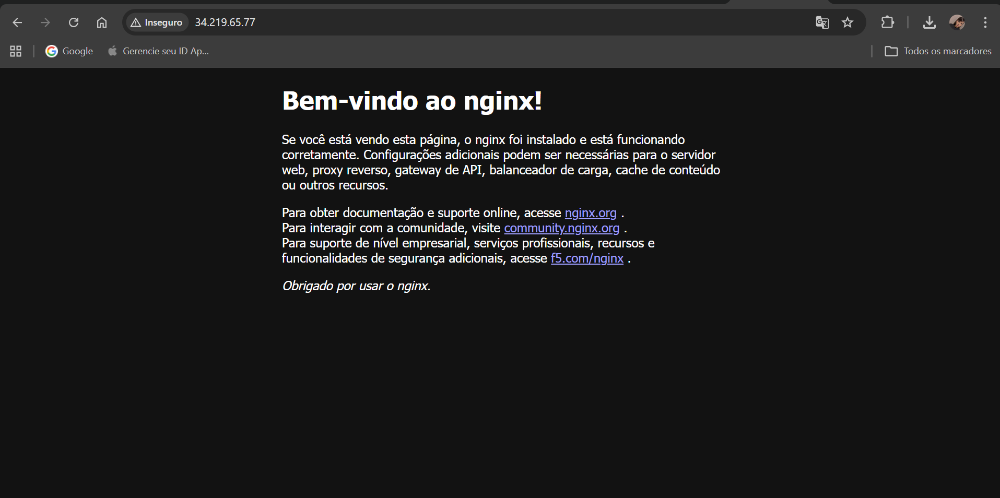

# Servidor Web Nginx com Docker na AWS EC2 🐳☁️

## 📋 Sobre o Projeto
Este repositório contém a documentação da configuração de um servidor web **Nginx** rodando dentro de um container **Docker** em uma instância **Amazon EC2** (Amazon Linux 2023). O objetivo foi aplicar conceitos de infraestrutura como serviço (IaaS) e conteinerização.

## 🛠️ Tecnologias Utilizadas
* **AWS EC2:** Instância `t3.micro` para hospedagem.
* **Docker:** Motor de containers para isolamento do servidor.
* **Nginx:** Servidor de alto desempenho para entrega de conteúdo HTTP.
* **Linux (SSH):** Gerenciamento remoto e configuração via terminal.

## 📸 Demonstração do Processo

### 1. Gerenciamento da Instância na AWS
Visualização da instância `web-server` em execução na região de Oregon (us-west-2), com o endereço IP público configurado.

---

### 2. Configuração via Terminal (SSH & Docker)
Acesso remoto à instância, atualização do sistema, instalação do Docker e execução do container Nginx mapeando a porta 80.

---

### 3. Resultado Final: Servidor Online
Página padrão do Nginx acessível através do IP público da instância, confirmando o sucesso da configuração.

---

## 🚀 Como reproduzir
1. Provisione uma instância EC2 com Amazon Linux 2023.
2. Acesse via SSH: `ssh -i "sua-chave.pem" ec2-user@seu-ip`.
3. Instale o Docker: `sudo yum install -y docker`.
4. Inicie o serviço: `sudo service docker start`.
5. Rode o container: `sudo docker run --name docker-nginx -p 80:80 -d nginx`.
6. Certifique-se de que o **Security Group** da AWS libera a porta 80 (HTTP).

---
**Desenvolvido por Geane Maria de Araujo Pereira** *Estudante de Gestão da Tecnologia da Informação*
